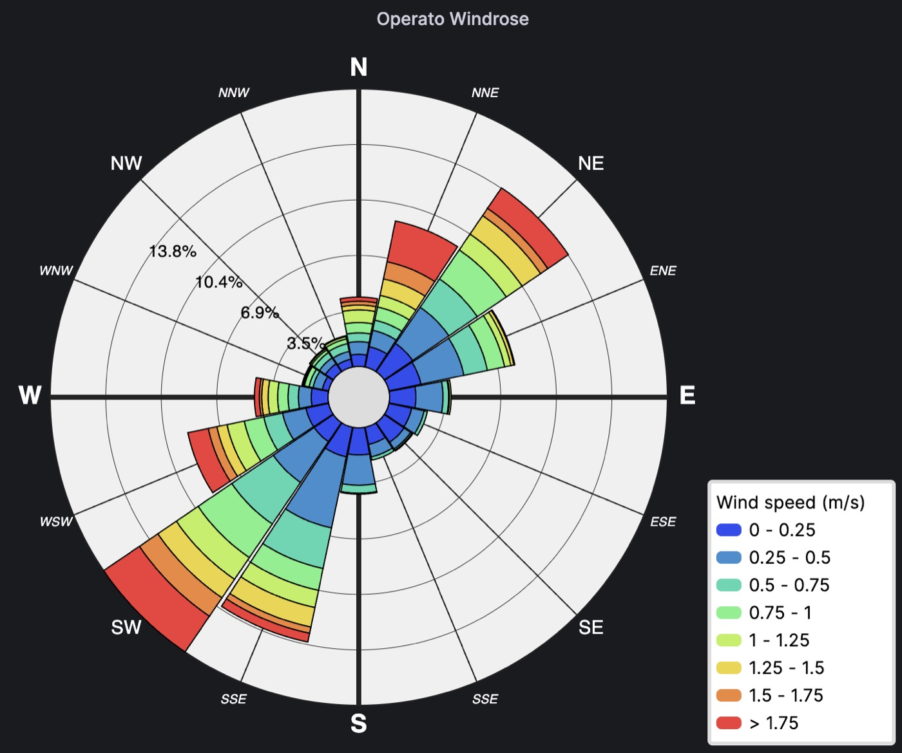

<!-- This README file is going to be the one displayed on the Grafana.com website for your plugin -->

# Operato Windrose 

Operato Windrose is a visualization panel for displaying wind weather data. 



## How to setup a Grafana dashboard with Operato Windrose panel?

### **Step 1:** 

Create new dashboard (obviusly) and add a new panel to it.

### **Step 2:**

Change panel type (from default Time series) to Operato Windrose.

### **Step 3:**

Setup data source and create query to provide your data to the Opero Windrose panel.

Example of SQL query for Operato Windrose panel:
``` sql
SELECT 
    wind_weather_data.speed AS wind_speed, 
    wind_weather_data.direction AS wind_direction
FROM wind_weather_data
WHERE wind_weather_data.time BETWEEN '2023-05-02T00:00:00Z' AND '2023-05-02T023:59:59Z'
```
The important thing to remember is that Operato Windrose will look for variables named `wind_speed` and `wind_direction`. **These names are fixed and cannot be changed!** If the variables in database do not match this naming scheme, they must bechaned by using SQL's `AS` operator (shown in example above). 

This plugin assumes that wind speed is provided in *m/s*!


### **Step 4:**

Configure the settings to best fit the visualization to your needs and preferences.

A short explanation of each of the settings can be found in the settings panel. But here is a bit longer explanation of most of the settings available in Operato Windrose panel:

- ***Petals per 90 degree:*** allows user to set how many petals will be in one quadrant. Total number of petals in graph will be 4-times the number set with this property.
- ***Buckets per each petal:*** How many speed buckets should be on each petal. Keep in mind that first bucket starts at 0 m/s and all negaitve values fall in the first bucket. Also all values greater than the upper limit of second to last bucket will fall in the last bucket.
- ***Speed bucket size:*** Sets the speed range (in m/s) of each bucket. Combined with *Buckets per each petal* setting, they set the total range of the graph. 
- ***Tooltip decimal places:*** This setting determines how many decimal places should be displayed in the tooltip when hovering over speed buckets.
- ***Windrose labels:*** Sets the type of labels to be displayed around the Windrose graph. Either *Compas directions* or *Degrees of rotation*. 
- ***Cardinal labels:*** Allows user to select the level of directions to be displayed on the graph: 
    - *Cardinal directions* (N,W,S,E), 
    - *Ordinal directions* (NW,WS,SE,NE)
    - *Intermediate directions* (WNW, NNW, NNE, ...)
- ***Show legend:*** Determines if the legend should be displayed.
- ***Does legend overlap:*** If turned on, the legend will overlap the Windrose graph. If turned off, the panel will make sure that the legend will not overlap the Windrose graph, no matter the size of the panel window.
- ***Wind speed unit:***: Used to change the unit of mesurement for wind speed. The following units are available:
    - *Meters per second (m/s)*
    - *Kilometers per hour (km/h)*
    - *Miles per hour (mph)*
    - *Feet per second (ft/s)*
    - *Knots (kt)*

# License
Apache License Version 2.0, see [LICENSE](https://git.operato.eu/open-source/operato-windrose-panel/-/blob/main/LICENSE).